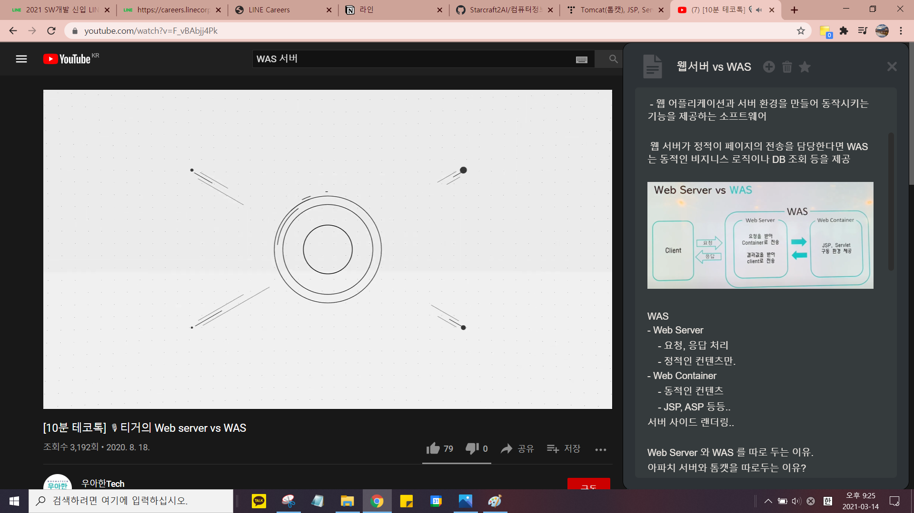
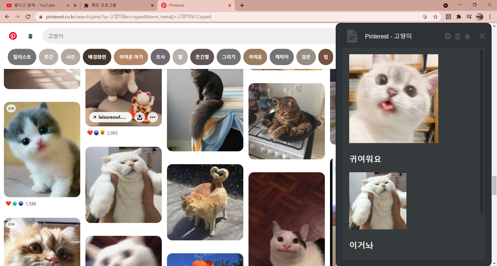

# 크롬 익스텐션 노트앱

아무 웹페이지에서나 단축키(alt+w)를 눌러 노트를 작성할 수 있는 크롬 확장프로그램

평소 노션과 구글 독스를 사용하며 개선됬으면 좋겠다 생각했던 요소들을 넣었다.

---

 

## 앱 활용

 

## 

유튜브로 강의 보면서 필기하기

 

## 

---

 

**디자인, UI UX**

    (완료)
    1. 버튼들에 마우스 hover 될 때 UI 처리.
    2. 기본이 어두운 테마. 구글 독스는 너무 밝다.
    3. 하단에 여백을 줘 항상 라인을 위로 올릴 수 있게함.
        (보통 코드 에디터들은 이렇게 되어있는데, 노션이나 구글 독스는 그렇지 않아서
        불편했었다. 시선이 아래로 향하니까)
    4. 노트 열고 닫는 단축키(alt+w)에서 w 가 눌리는 시점을 keydown 으로 설정 =>
        keyup 일 때보다 반응이 빠릿빠릿하다는 느낌을 줌.
    5. 노트가 열리는 기준
        - 현재 url 에서 가장 최근에 수정된 노트가 열림.
        - 제목을 클릭하면 최근 작성한 노트리스트가 나타나고
        [전체문서], [현재 URL] 를 눌러 노트리스트를 필터링
        할 수 있다.

---

**버그해결**

- 네이버에서 키 입력시 포커스를 검색창으로 가져가버리는 문제
  : e.stopPropagation() 으로 해결

---

### 알게된 것, 인상깊었던 것

- arrow function 의 this는 lexical scope 를 따른다.
   (이걸 알기전에는 let that = this 식으로 했었음.
   이런 방식의 문제는 이름 일괄변경이 안된다는 것.)

- selection, range
   selection과 range로 커서(caret) 조작을 할 수 있다.

- 조건에 따라 border를 줄 때,
    border 자체를 없애고/만들고 하게되면 요소크기가 변경된다. (bad)
    border 의 색상(투명도)을 변경하는 것으로 처리를 해주는게 좋다. (good)

- JS 이벤트 플로우

  1. window 에서 시작된 이벤트가 target(실제 발생지점) 까지 capturing
  2. target 에 도착
  3. 다시 window 로 bubbling
      => 이벤트 플로우를 이용해 title, content 2군데에 흩어져있던 동일한 처리부분을 App 1군데로 모을 수 있었다.

---

### 앞으로 개선할 것들

- tab 동작 개선
- ~~페이지에서 열리는 노트에서 최근 작성한 노트 목록을 볼 수 있게~~
- ~~관리 페이지 노트 정렬 기능~~
- ~~노트 삭제, 중요 표시 기능~~
- ~~icon : 지금 fontawesome 의 icon 을 사용중인데, 노션, 깃헙 등에서 이를 막는 경우가 있음. 로컬에 저장해서 사용할 수 있는 icon 구하기~~
- font : 노산 폰트를 사용 중.. 버그 적음. (ex. 먛, 븇 => 이런 거 공백으로 나오는 폰트들 많음.)   But, 가독성이 좋지 않은 듯함. 글자간격이 너무 좁음. -> 기본 arial 폰트 사용

  ~~&nbsp;&nbsp;&nbsp;&nbsp;&nbsp;~~ : 완료

  더 자세한 기록 :
  <https://www.notion.so/2-5e55bb53ae8e4d1a85122509bb40dbf9>
