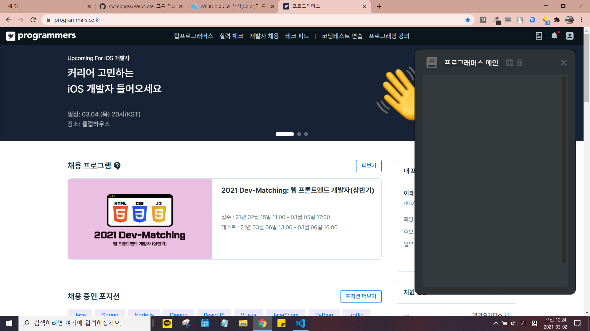
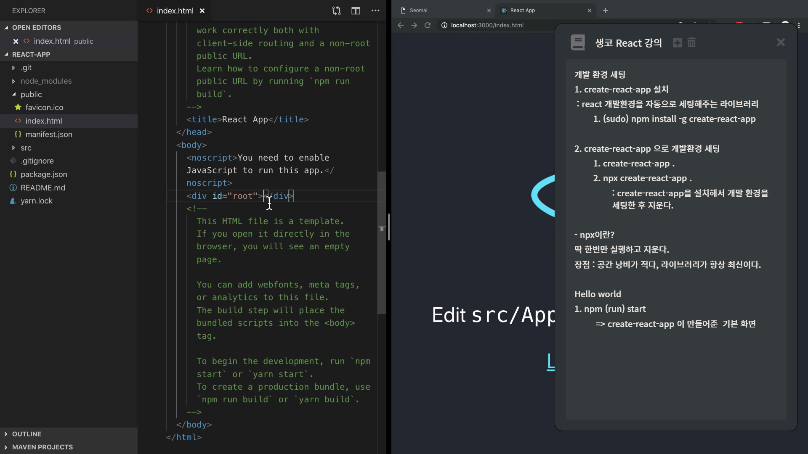

# 크롬 익스텐션 노트앱

단축키(alt+w)를 눌러 노트를 불러와 작성할 수 있는 크롬 확장프로그램

평소 노션과 구글 독스를 사용하며 개선됬으면 좋겠다 생각했던 것들을 적용했다.

## 활용

유튜브로 강의 볼 때.. 필기하기 좋음.

## 신경 쓴 부분들

디자인, UI UX

- 노트 하단에 여백을 줘 항상 라인을 위로 올릴 수 있게함.
   (보통 코드 에디터들은 이렇게 되어있는데, 노션이나 구글 독스는 그렇지 않아서 불편했었다. 시선이 아래로 향하니까..)
- 버튼들에 마우스 hover 될 때 UI 처리.
- 어두운 배경.. 구글 독스는 너무 밝아..

### 알게된 것, 인상깊었던 것

- arrow function 은 this 바인딩을 안한다는 것.
  (let that = this 식으로 this를 유지시키던 걸 모두 arrow function에서 this를 쓰는 걸로 바꿈.)

- selection, range
   selection과 range로 커서(caret) 조작을 할 수 있다.

- border도 공간을 차지하기 때문에
   border 자체를 없애고/만들고 하게되면 디자인에 영향을 준다.
   border 의 색상을 변경하는 것으로 처리를 해주는게 좋다.

  더 자세한 기록 :
  <https://www.notion.so/2-5e55bb53ae8e4d1a85122509bb40dbf9>
