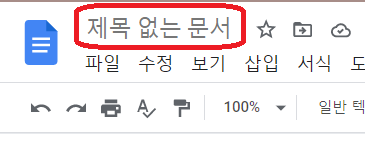

## 구글 독스 제목 클론

---

디자인

    - 내부 텍스트에 input 컨테이너 맞춤.
    - 마우스가 hover 되면 border 표시

---

동작

    - 클릭됬을 때 & 제목 == undefined (="제목 없는 문서")
        * 전체 선택
    - 엔터, ESC => 문서로 포커스 넘어감.
        * 제목 == "" => 제목 = undefined

### 알게된 것, 인상깊었던 것

- selection, range
   selection과 range로 커서(caret) 조작을 할 수 있다.

- border도 공간을 차지하기 때문에
   border 자체를 없애고/만들고 하게되면 디자인에 영향을 준다.
   border 의 색상을 변경하는 것으로 처리를 해주는게 좋다.

  더 자세한 기록 :
  <https://www.notion.so/2-5e55bb53ae8e4d1a85122509bb40dbf9>
